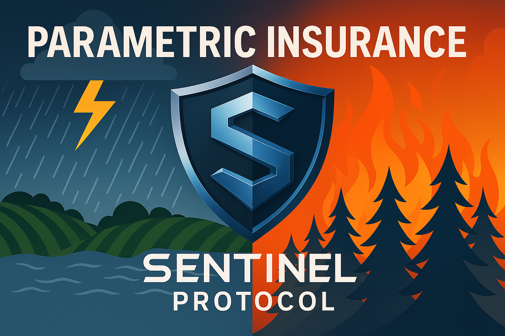

# Sentinel Protocol

**Please see our technical documentation here**
[Technical Documentation](https://github.com/SentinelFi/build_36_submission/blob/main/technical.md)

# Build round 36 Submission: 

## Submission Title 
Flight Delay Parametric Insurance

## One Sentence Description: (130 characters)
Parametric insurance framework for any risk, starting with flight delay coverage using reliable oracles and smart contract payouts

## Project URL:
https://sentinel-finance.vercel.app/

## Code URL: 
https://github.com/SentinelFi#-sentinel-protocol-repositories

## Products & Services

Traditional indemnity insurance is pulling back in the face of rising climate risks. In 2024, climate-related disasters caused **94 billion dollars** in U.S. losses, according to [NOAA](https://www.ncei.noaa.gov/access/billions/summary-stats). Major insurers like **State Farm**, **Allstate**, and **Farmers** have exited or paused new business in states like California. **Chubb**, **Travelers**, and **USAA** each reported over **1 billion dollars** in wildfire-related losses. As a result, **parametric insurance** is gaining traction as a faster and more transparent alternative. The **California State Assembly** recognized its potential in a recent [insurance reform report](https://ains.assembly.ca.gov/system/files/2024-10/10.9.24-background.pdf).

**Sentinel Protocol** is a modular parametric insurance framework built on the **Soroban blockchain**. It connects users seeking protection with DeFi investors who underwrite risk in exchange for yield. Smart contracts and decentralized oracles automate claims and payouts, removing intermediaries and ensuring transparency at every step.

The protocol can support any real-world risk where reliable oracle data is available. Our first product is **Flight Delay Insurance**, which pays users automatically if their flight is delayed beyond a set threshold. The product launches first on **Testnet**, followed by a **Closed Beta on Mainnet**, with a streamlined user interface for travelers and a dashboard for capital providers.

We began with the **Kickstart Grant**, which helped us validate Sentinel’s technical foundation. While we have made meaningful progress, there is still much to build. You can find a detailed update on our technical progress and roadmap in the [Technical section](https://github.com/SentinelFi/build_36_submission/blob/main/technical.md).

Built natively on Soroban, Sentinel Protocol uses:
- **Soroban Smart Contracts** to automate all core operations including deposits, claims, and payouts.
- **Acurast Trusted Execution Environment (TEE)** to deliver real-time, tamper-resistant data to the blockchain.
- **Stellar SDKs** used to connect **liquidation bots** and **keepers** that advance the protocol's state and coordinate interactions seamlessly.

We are open-sourcing the **Sentinel Protocol** framework to support the Soroban developer community, offering reusable components like modular vaults, oracle pipelines for Web2 data, and automation tools such as liquidation bots and keepers. Alongside this, we’re releasing documentation, tutorials, and videos to help others build or extend Sentinel for new DeFi use cases. The framework is flexible and designed for easy deployment of parametric insurance products across diverse risk markets, with the goal of disrupting traditional insurance and enabling others to build on top of it.

Our market contract includes a configurable commission fee that allows the deployer to earn revenue as a creator or intermediary. Whether we plan to monetize the open-source framework by charging other teams is still open for discussion and experimentation.

In short, Sentinel Protocol provides the following: 

- For the developer community:
  - A reusable ERC-4626 style vault standard for any DeFi project on Soroban
  - Oracle integration using Acurast TEE to securely fetch Web2 API data
    - Among the first implementations bringing Acurast to Soroban
    -  Expands oracle capabilities beyond on-chain asset prices (e.g., flight data, fire zones)
  - Example liquidation bots and keepers to automate contract state progression
  - Full developer support with documentation, tutorials, and example integrations

- For DeFi yield seekers:
  - Earn yield by underwriting real-world risks
  - Transparent vaults with automated payouts
  - Uncorrelated returns tied to actual insurance demand

- For insurance buyers:
  - Easy-to-use UI to purchase protection
  - Instant, automated payouts triggered by real data
  - No middlemen, claims, or delays

## Traction Evidence: 

The global parametric insurance market was valued at 16.2 billion USD in 2024 and is projected to grow at a 12.6 percent CAGR through 2034, according to [Global Market Insights](https://www.gminsights.com/industry-analysis/parametric-insurance-market). Our first product targets the flight delay insurance market, valued at 1.37 billion USD in 2024, growing at 14.5 % CAGR, per [Business Research Insights](https://www.businessresearchinsights.com/market-reports/flight-delay-insurance-market-113081). We aim to capture early market share by getting real users into live parametric markets—starting with Flight Delay Insurance. 

Since receiving the Kickstart Grant, our two-person developer team has been focused on shipping. We’ve made significant technical progress on Sentinel Protocol, a modular on-chain insurance framework built on Soroban. Highlights include:
- Built a modular ERC-4626 equivalent vault standard, ready for internal use. [View the repo](https://github.com/SentinelFi/soroban_vault/tree/main/soroban-4626/contracts/vault).
    - ERC‑4626 style vault contracts are rapidly gaining adoption, with usage up **32.23%** since October 2024 according to Glider data by Hexensio ([source](https://x.com/hexensio/status/1910643450862514660)). This shows that developers are increasingly looking for shared, plug-and-play standards for interest-bearing assets. It's a strong signal that Soroban has an opportunity to capture this momentum by supporting DeFi protocols that rely on vault primitives.

- Collaborating with OpenZeppelin to contribute the vault to their Soroban token library. [Opened Issue, PR to follow](https://github.com/OpenZeppelin/stellar-contracts/issues/148)  
- Integrated Acurast TEE with Soroban for secure Web2 data feeds. [Integration code](https://github.com/SentinelFi/sentinel-scripts/blob/main/index.js)  

We’ve also validated real use cases and built functional prototypes:
- We have built Hedge/Risk Market based on vault primitive. [ Contract Code](https://github.com/SentinelFi/soroban_vault/tree/main/soroban-4626/contracts/market)
- General Hedge and Risk Market UI built and ready for testing, designed to support multiple parametric insurance markets including Flight Delay Insurance. [View UI](sentinel-finance.vercel.app) and the [UI Code](https://github.com/jsmaxi/sentinel-protocol-frontend)  
- Fire Insurance prototype using NASA FIRMS satellite data on top of our framework to demonstrate that given oracle data, we can build Parametric Insurance (Hedge Market) on any vertical. [Project link](https://github.com/SentinelFi/insurance_fire)  
- We’ve engaged with teams exploring new verticals on top of the Sentinel framework, including a project focused on crop insurance for drought risk in West Africa - they are in the process of applying to Kickstarter Round 11.
- We conducted 12 user interviews at ETHDenver 2025, and during the Kickstart Week including DeFi yield seekers and insurance buyers.

Early simulations show strong yield potential across multiple insurance verticals, indicating a sustainable model for risk investors:

- Flight delay insurance, modeled using over 10,000 Monte Carlo simulations with delay probabilities from 1% to 20%, shows a median yield of 96.11% at a 3-hour delay threshold. [Flight delay yield analysis](https://github.com/SentinelFi/yield_analysis) 
- 1,000 properties with $3,000 annual premiums and $150,000 payouts were simulated with fire probabilities between 0.3% and 1.7%. Across thousands of runs, the average annual yield ranged from 40% to 50%, showing consistent profitability despite risk variability.. [Fire Insurance Yield analysis](https://github.com/SentinelFi/insurance_fire?tab=readme-ov-file#is-this-sustainable)

With the Build Award, we will complete the remaining infrastructure and then shift our focus to onboarding insurance buyers and capital providers—testing live markets, validating sustainable yields, and accelerating real-world adoption.

## Technical Architecture

https://github.com/SentinelFi/build_36_submission/blob/main/technical.md

## Thumbnail: 

## SCF Build Tranche Deliverables

### Tranche 1 – MVP *
- **Total Budget:** $41,600  
- **Timeline:** 6-7 weeks after receiving funds 

#### 1. Smart Contract & Architecture Changes – $19,200

- Implement the **Central Risk Vault Architecture**, replacing per-market risk vaults with a single pooled vault that supports multiple Hedge Vaults, improving capital efficiency and investor exposure.  [Technical Documentation](https://github.com/SentinelFi/build_36_submission/blob/main/technical.md#%EF%B8%8F-central-risk-vault-architecture)

- Re-evaluate the **Hedge Vault design** to explore enhancements like dynamic pricing or pooled buyer tranches, aimed at optimizing capital use and user experience for insurance buyers.  

- **Timeline:** 5-6 weeks after receiving funds  

- **Completion Criteria:**  The new Controller contract and Market Maker have been deployed. New markets are now being created with individual Hedge Vaults, all connected to a single, centralized Risk Vault. The architecture is currently passing internal tests.

#### 2. Purpose-Built Flight Delay Insurance Interface – $16,000  
- **Timeline:** 5-6 weeks after receiving funds  
- **Completion Criteria:** The UI for Flight Delay Insurance has been fully redesigned, moving away from a generalized Hedge/Risk Market interface to a purpose-built experience. Insurance Buyers and Risk Investors now have dedicated dashboards, offering intuitive deposit and withdrawal flows for investors, and a streamlined coverage purchase flow for buyers. Liquidation events and oracle-triggered data are clearly displayed, enhancing transparency across the system.

#### 3. Acurast Oracle Integration Documentation - $1,600

- A key innovation from our Kickstarter phase was integrating **Acurast Oracles** with Soroban using **Trusted Execution Environments (TEEs)**. Unlike EVM ecosystems that offer solutions like Chainlink Functions, Soroban lacks native support for fetching Web2 data on-chain—this integration offers a viable alternative. As part of this milestone, we will publish documentation, example contracts, and a technical article to help developers bring verifiable Web2 API data into their Soroban smart contracts using Acurast.

- **Timeline:** 2-3 weeks after receiving funds  

- **Completion Criteria:** Full documentation, and integration example and developer facing article.

#### 4. Vault Standardization – $4,800
- Finalize our internally complete Vault logic for external adoption, including documentation, usage examples, and a developer-facing article to support broader integration across the Soroban ecosystem.
- Submit the contract to the OpenZeppelin Soroban Contracts library as a reusable DeFi primitive. (We already started the process)
- Propose the Vault as a Soroban Ecosystem Proposal (SEP) on the Standards track for potential endorsement by the Stellar Development Foundation (SDF).

- **Timeline:** 6-7 weeks after receiving funds  

- **Completion Criteria:** Deployed contract, full documentation, and integration example and developer facing article.

*Note: Timelines for OpenZeppelin and SDF endorsement are external and not under our control, but we will align with their guidelines and contribute actively.*

### Tranche 2 – Testnet  
- **Total Budget:** $44,800  
- **Timeline:** 12-14 weeks after receiving funds 

#### 1. Oracle Infrastructure Update – $19,200

- Deploy a **Flight Data Aggregator Contract** to decouple data ingestion from the Controller, enabling scalable and reusable oracle feeds.

- Set up an **Acurast TEE script** to fetch flight data of many flights and push updates to the aggregator, allowing Sentinel contracts to query flight status asynchronously for improved efficiency.  [Read More](https://github.com/SentinelFi/build_36_submission/blob/main/technical.md#%EF%B8%8F-oracle-layer-enhancements)

- **Timeline:** 12-14 weeks after receiving funds 

- **Completion Criteria:** A deployed contract that reliably holds aggregated flight data, with a modular pipeline in place that supports scalable integration of additional flight routes for future insurance markets.

#### 2. Automate Market Creation – $16,000  

- Implement logic to auto-deploy a new **Hedge Vault** when a user initiates coverage for a tracked flight, register it with the **Controller Contract**, and link it to the shared **Central Risk Vault**—enabling parallel, scalable insurance markets with minimal manual setup.  [Read More](https://github.com/SentinelFi/build_36_submission/blob/main/technical.md#%EF%B8%8F-automated-market-creation)

- Integrate this flow with the existing UI and build a **webhook trigger** that creates new markets in real-time as users purchase coverage.

- **Timeline:** 12–13 weeks after receiving funds  
Deploy a permissionless **Vault Factory Contract** to allow anyone to launch Hedge Vaults linked to the central Risk Vault.

- **Completion Criteria:** A new Hedge Vault is automatically deployed, registered, and linked to the Central Risk Vault upon user purchase, with the process fully integrated into the UI and triggered via webhook.

#### 3. Testnet Launch & E2E Testing – $9,600

- Deploy the full Sentinel Protocol stack to testnet and perform **manual end-to-end testing via the UI**, including vault interactions, oracle events, and claim flows.  

- Build and execute an **automated E2E test suite** covering deposits, withdrawals, oracle updates, payouts, and liquidation logic across key user scenarios.

- **Timeline:** 12-14 weeks after receiving funds  

- **Completion Criteria:**  Full protocol deployed on testnet with manual testing verified through the UI and an automated E2E test suite executed covering all critical flows, confirming system readiness for mainnet.

### Tranche 3 – Mainnet
- **Total Budget:** $41,600
- **Timeline:** 5-6 months after receiving funds 

#### 1. Liquidation and Keeper Bots – $12,800

- Develop an open-source **Liquidation Bot**, including a working example that anyone can run to monitor oracle data and trigger claims. [Read More](https://github.com/SentinelFi/build_36_submission/blob/main/technical.md#-liquidation-bots-and-keepers)

- Add Protocol level incentives for people to run these bots.

* Explore decentralized automation using **Acurast TEEs** to replace centralized cron jobs with trust-minimized, off-chain keepers.

- **Timeline:** 19-20 weeks after receiving funds  

- **Completion Criteria:**  - Automation flows no longer depend on centralized cron jobs, with at least one open-source bot live on testnet and Acurast-based keeper integration validated.

#### 2. Yield Study and Flight Insurance Parameters – $12,800 
- Expand our preliminary Monte Carlo simulation into a deeper study using real flight delay data from FlightAware and similar sources to assess vault profitability and capital efficiency.  

-  Analyze high-traffic routes within the continental US to identify promising markets for insurance, estimating coverage amounts, expected payouts, and premium pricing based on delay frequency and passenger volume.

 - **Timeline:** 19–20 weeks after receiving funds  

- **Completion Criteria:**  We will produce a detailed analysis including median expected yield projections and identify at least **50 insurable routes** with recommended coverage and pricing parameters.

#### 3. Mainnet Launch (Closed Beta) and Audit Pass Work – $16,000 
- Conduct pre-audit reviews and internal security testing to prepare the Sentinel contracts for a professional third-party audit.  
- Pass safety Audits with help from Stellar Launchkit.
-  Address and implement all audit findings, update documentation, and finalize deployment configurations to prepare for mainnet launch. 
- **Timeline:** 5-6 months after receiving funds  

- **Completion Criteria:** We will successfully pass the audit with support from **Stellar LaunchKit**, having resolved all critical and high-risk issues. We also would have deployed all our contracts on Mainnet and have launched a Closed Beta.

*Note: The budget here is to meet audit standards (not the audit cost itself), it is also to address audit issues as they arise.

## Budget
$ 128,000

## Go to Market 

We have an ambitious goal: to disrupt the parametric insurance market by leveraging **Soroban** to bring transparency, automation, and trustless execution to an industry that remains opaque and slow. While six months and a limited budget are not enough to realize the full vision, this phase gives us a strong foundation to prove product-market fit, engage early partners, onboard beta testers, and demonstrate the viability of on-chain insurance.

 As we move forward, we are laying out the next evolution of the Sentinel framework and developing clear strategies to capture market share across high-impact insurance verticals.

### 🛠️ Future Plans for the Framework

* Integrate Reclaim Protocol or similar zkTLS frameworks to enable zero-knowledge proofs of personhood and actions like flight ticket purchases. 

* Join accelerators like Draper University, Tachyon, or a16z Crypto Startup School to raise funding, and grow the team for accelerated development.

* Explore additional TEE platforms like Phala Network and Lit Protocol to ensure flexibility and long-term reliability beyond Acurast.

* Build a more resilient Oracle layer by averaging data from multiple APIs to improve accuracy and reduce dependency on single sources.

### 📈 Ideas to Capture Market Share

* Target flight insurance for major crypto events like Token2049, ETHDenver, and Devcon—where crypto-native travelers are highly concentrated. Explore partnerships with ETHGlobal to include our coverage in their “Hacker Pack” or “City Pack” offerings. Here's an example -  [Denver pack](https://ethglobal.com/packs/denver).

* Form partnerships with travel platforms like Expedia to offer flight delay and weather-proof vacation insurance directly to travelers at the point of booking.

* Initially, launch our own Chrome extension to bypass partnership dependencies and directly offer users flight and weather insurance, with built-in incentives to encourage adoption.

* Position Sentinel as the default backend for on-chain insurance startups by offering plug-and-play tooling to launch new markets. Sponsor hackathons to encourage teams to build insurance products on top of our framework.

* After the Closed Beta launch, host regular X Spaces and grow a vibrant Discord community to drive awareness, onboard users, and engage DeFi-native participants interested in underwriting risk.

* Launch domain-specific verticals (e.g. wildfire protection in California, hail damage in the Midwest) based on real-world demand and high-risk conditions.

* Partner with influencers and climate advocacy groups to raise awareness and drive adoption of insurance products targeting climate-related risks and extreme weather events.

* Offer capital incentives to early insurance underwriters, particularly in new markets with high yield potential.

* Develop tailored onboarding flows and educational content for specific user segments (e.g., small farmers, remote workers, frequent flyers).

## Success Criteria: 
- Flight Delay Insurance is live as a Closed Beta on Soroban mainnet, built on top of Sentinel Protocol—an on-chain, trustless, and automated parametric insurance framework.  
- Investors gain access to real-world asset (RWA) yield opportunities through flight insurance markets, backed by a detailed yield study demonstrating capital sustainability.  
- Developers benefit from a standardized Vault primitive and a modular oracle pipeline for bringing verifiable Web2 non-financial data on-chain via Acurast TEEs.
- The protocol is ready to onboard other teams building insurance products in new verticals, including but not limited to fire coverage, hail damage, crop yield protection, and earthquake insurance. 

