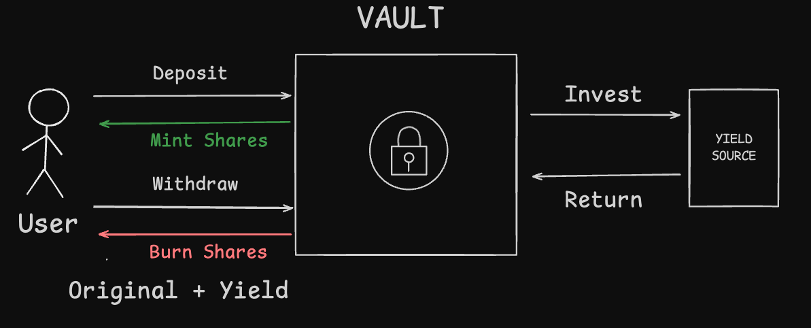
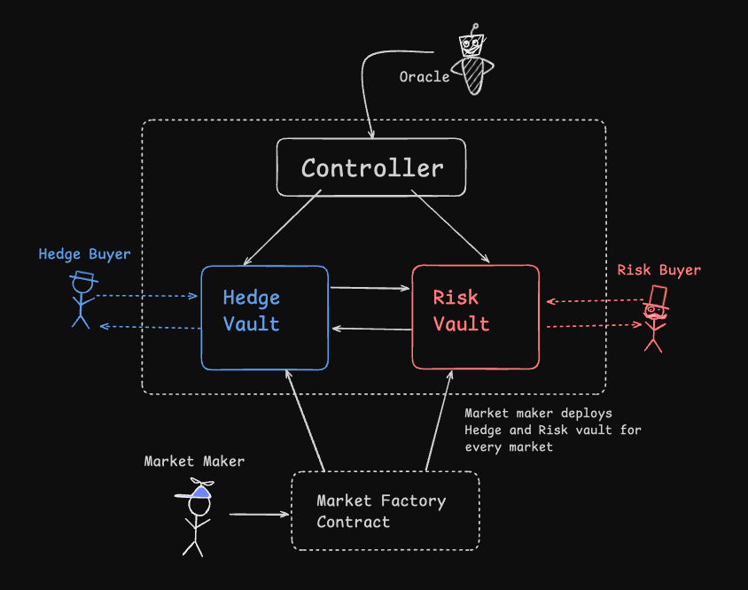
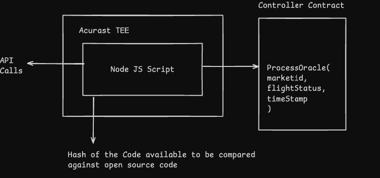
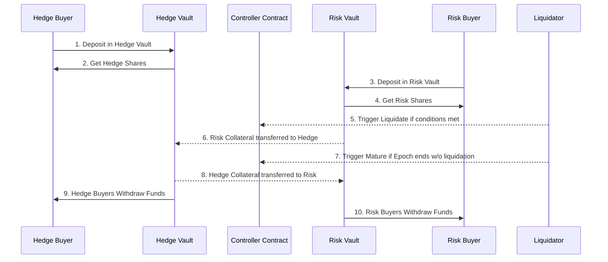
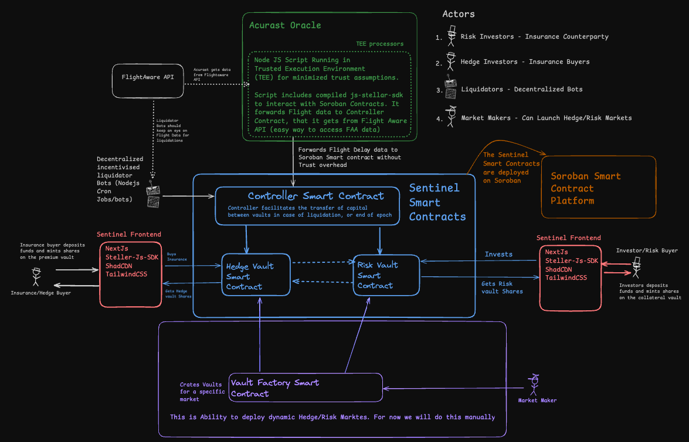
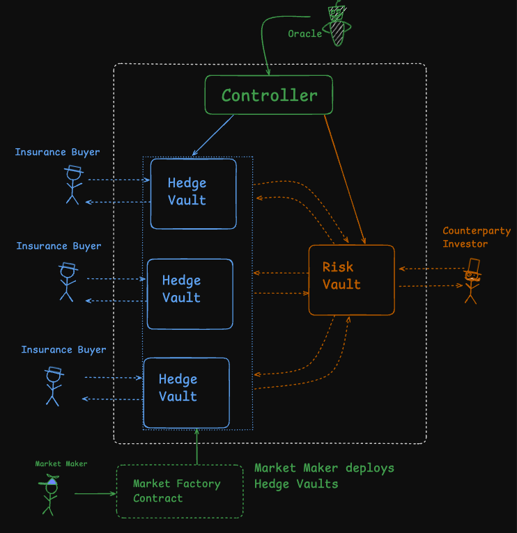
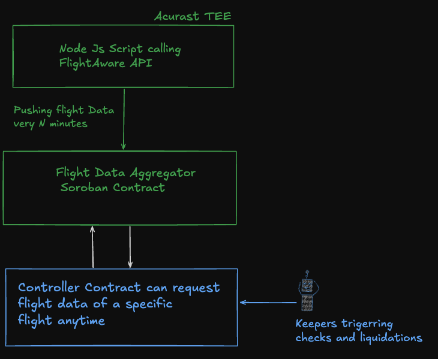

# Technical Architecture

## Table of Contents

- [Technical Architecture](#technical-architecture)
  - [Kickstart Phase Progress](#kickstart-phase-progress)
    - [Vault Standard on Soroban](#-vault-standard-on-soroban)
    - [Hedge/Risk Market Implementation](#-hedgerisk-market-implementation)
    - [Acurast Oracle Integration](#-acurast-oracle-integration)
    - [Contract Sequence Diagram](#contract-sequence-diagram)
    - [Insurance Use Case: Flight Delay POC](#-insurance-use-case-flight-delay-poc)
    - [Protocol Actors](#-protocol-actors)
    - [Manual Market Creation](#-manual-market-creation)
  - [What’s Next: Build Award Focus](#-whats-next-build-award-focus)
    - [Central Risk Vault Architecture](#-central-risk-vault-architecture)
    - [Oracle Layer Enhancements](#-oracle-layer-enhancements)
    - [Automated Market Creation](#-automated-market-creation)
    - [Re-evaluating Hedge Vault Architecture](#re-evaluating-hedge-vault-architecture)

 We're splitting the technical architecture document into two parts:  
 1. **Kickstart Progress** – everything we've accomplished since receiving the Kickstarter award  
 2. **Build Plan** – what we intend to develop once we receive the Build award  

 Feel free to jump to the sections you're most interested in below:

## Kickstarter Phase Progress

After receiving the Kickstarter Grant, we focused on validating the core building blocks required to enable decentralized parametric insurance on Soroban. This phase was centered on proving that each component, such as vaults, controllers, and oracles, could function both independently and together as a system.  
 
As part of this work, we also developed a functional Hedge and Risk Market proof of concept with flight delays, demonstrating that Sentinel Protocol can serve as a strong foundation for building real world risk markets using trust minimized infrastructure.

### 🧱 Vault Standard on Soroban

 A **vault** is a smart contract that securely holds user deposits and automates how those funds are used, often to generate yield or manage risk. The **ERC-4626** standard defines a consistent interface for tokenized vaults that manage yield-bearing assets. It streamlines how users deposit and withdraw funds while allowing protocols to build on top of vaults with predictable behavior and accounting.  

 

We successfully ported the ERC-4626 vault standard, a widely adopted pattern in Ethereum DeFi for managing deposits and yield strategies, to Soroban using Rust-based smart contracts. This implementation is open and modular, allowing anyone to use it as a DeFi primitive within their own protocols.

[View the Vault Repo](https://github.com/SentinelFi/soroban_vault/tree/main/soroban-4626/contracts/vault) to explore the implementation.

### ⚖️ Hedge/Risk Market Implementation

The **Hedge/Risk Market** is built on top of the `ERC-4626` vault primitive we ported to Soroban. This structure enables a decentralized insurance-like system where users can either hedge against specific real-world risks or underwrite those risks in exchange for yield.

At the heart of each market are two vaults:

- A **Hedge Vault** for users seeking protection (insurance buyers)  
- A **Risk Vault** for users willing to take on the risk (risk investors)  

Each vault is deployed as a 1:1 pair for a specific market, and these are automatically created by a **Market Creator Contract**. This contract allows anyone to become a **market maker** by launching a new risk market (e.g. *"Flood in Lagos during August"*). Once deployed, users can begin depositing into either side depending on whether they want to hedge or take risk.

#### 🛠️ How the System Works

- **Hedge Buyers** deposit into the Hedge Vault to protect themselves against a defined event (such as drought or wildfire). If the event occurs, they are compensated.  
- **Risk Investors** deposit into the Risk Vault and earn yield from the premiums paid by hedge buyers. If the event does **not** occur, they keep the yield. If it **does**, their funds are used to pay out claims.  
- A centralized **Controller Contract** monitors all active vaults. It interacts with off-chain oracles (such as Acurast) to verify whether the event occurred. If a payout condition is met, the controller redistributes funds from the Risk Vault to the Hedge Vault.  

### 🌐 Acurast Oracle Integration

A key innovation of our Kickstarter phase was integrating **Acurast Oracles** into Soroban using **Trusted Execution Environments (TEEs)**.

- We wrote a **Node.js script** that runs inside an Acurast TEE processor.
- In our case, the script fetches **flight data** from the [FlightAware API](https://www.flightaware.com/commercial/aeroapi/) and forwards it to our smart contracts using `js-stellar-sdk`.
- To ensure authenticity, the controller only accepts signed messages from a whitelisted oracle address.

This allowed us to forward real-world data into Soroban **securely and without centralized servers**, aligning with the trust-minimization goals of the protocol.

### Contract Sequence Diagram

The Sentinel Smart Contracts are the core of the system, facilitating the interactions between hedge buyers, risk buyers, and liquidators. The following sequence diagram outlines how these actors and smart contracts interact step by step:

1. **Hedge Buyer** deposits in **Hedge Vault**.
2. **Hedge Buyer** receives **Hedge Shares** representing their ownership in the Hedge Vault.
3. **Risk Buyer** deposits in **Risk Vault**.
4. **Risk Buyer** receives **Risk Shares** representing their ownership in the Risk Vault.
5. **Liquidation** is triggered if conditions are met, typically by a **Liquidator** monitoring external conditions (e.g., flight delays).
   - If liquidation occurs: 
     - **Risk collateral** is transferred to the **Hedge Vault**.
6. If no liquidation occurs and the **epoch ends**, the liquidator triggers a **maturity event**.
   - If maturity is triggered:
     - **Hedge collateral** is transferred to the **Risk Vault**.
7. **Hedge Buyers** withdraw their funds from the **Hedge Vault**.
8. **Risk Buyers** withdraw their funds from the **Risk Vault**.

This process ensures a trustless and automated mechanism for managing the flow of funds between the Hedge and Risk Vaults, depending on whether the conditions for liquidation or maturity are met.

### 🛡️ Insurance Use Case: Flight Delay POC

We combined all the above components into a working **Flight Delay Insurance Proof of Concept**:

- Users deposit funds into Hedge or Risk Vaults to bet on whether a flight will be delayed beyond a fixed threshold (e.g., 3 hours).
- An oracle running on Acurast monitors the flight status and triggers contract logic when a delay is detected.
- If the delay occurs, the Risk Vault is liquidated, and capital flows to the Hedge Vault (paying the insured party).
- If no delay occurs by market maturity, the Hedge Vault’s capital goes to the Risk Vault.

This demonstrated that **parametric insurance** can be implemented on Soroban using decentralized, programmable primitives.

### 🎭 Protocol Actors

The Sentinel Protocol involves four key types of actors who interact with vaults, oracles, and smart contracts to create and operate decentralized hedge and risk markets.

#### 1. Risk Investors (Insurance Counterparties)
These users deposit capital into the Risk Vault to underwrite coverage and earn yield from unclaimed premiums. They take on the financial risk if the insured event occurs.

#### 2. Hedge Buyers (Insurance Buyers)
These users deposit into the Hedge Vault to protect themselves against a predefined real-world event. If the event happens, they receive a payout.

### 3. Liquidators (Decentralized Bots)
Automated bots monitor vaults and oracle feeds to trigger liquidations or claim payouts when conditions are met. They ensure timely execution and enforce protocol rules.

#### 4. Market Makers
Market makers create new risk markets by deploying a pair of Hedge and Risk Vaults through the Vault Factory Contract. This enables permissionless expansion of the protocol.

### 🧪 Manual Market Creation

For the initial Proof of Concept, we **manually deployed** Hedge and Risk Vaults for a single flight delay market. Since the oracle script only includes data for one specific flight (hardcoded into the script running inside the Trusted Execution Environment), each market had to be created manually.

- The **Vault Factory** was not yet implemented, so we handled market creation ourselves.
- The Sentinel team acted as the **market maker**, manually deploying vaults for this flight.

While this setup is not scalable, it was sufficient to validate the end-to-end insurance flow and test how the oracle, controller, and vaults interact in a real scenario.

## 🔗 What’s Next: Build Award Focus

Our initial design for Flight Insurance focused on simplicity—isolated markets and binary outcomes—to validate the core mechanics: vault deposits, oracle-triggered payouts, and liquidation logic. This structure successfully demonstrated the feasibility of on-chain insurance, but it also revealed key limitations that must be addressed before scaling into a production-ready platform.

- **Capital fragmentation**  
  Investors are required to deposit into individual flight-specific markets, making it difficult to manage capital efficiently and leading to underutilized funds.

- **All-or-nothing liquidation**  
  When a flight is delayed beyond the threshold, the entire Risk Vault is liquidated. While functional for binary scenarios, this lacks the nuance required for real-world insurance, where partial or capped payouts are standard.

This architecture behaves more like a prediction or betting market than a sustainable parametric insurance product. To move toward a robust, scalable framework, we propose the following key improvements:

- Central Risk Vault Architecture  
- Oracle Layer Enhancements
- Automated Market Creation

Let’s explore each in detail.

### 🏛️ Central Risk Vault Architecture
To address capital fragmentation and enable more scalable insurance logic, we are transitioning to a **Central Risk Vault Architecture**. Unlike the original 1:1 market structure—where each market required its own pair of Hedge and Risk Vaults—this upgraded design introduces a single, unified **Risk Vault** that services multiple Hedge Vaults.

Each new insurance market now only deploys a **Hedge Vault**, significantly reducing deployment overhead and simplifying capital flow. Risk investors deposit once into the central Risk Vault and gain diversified exposure across all active markets without needing to manage each individually.

To make risk exposure predictable and safe for investors, the architecture supports **capped payouts**. Each Hedge Vault defines a maximum disbursement limit per claim. For example, a $10 premium might entitle the buyer to a $100 capped payout, regardless of the severity of the triggering event.

This structure improves capital efficiency, simplifies the investor experience, and brings the architecture closer to traditional pooled insurance models—while maintaining the transparency and automation benefits of smart contracts.

### 🛰️ Oracle Layer Enhancements

In our original implementation, oracle data was sent directly to the Controller Contract. While simple, this approach limited scalability and made data access tightly coupled to specific contract interactions.

To address this, we’re introducing a more modular and scalable **oracle pipeline**, inspired by Chainlink’s price feed architecture. As shown in the diagram, we’ve inserted a **Flight Data Aggregator Contract** between the oracle data source and the controller logic.

- A **Node.js script running inside Acurast TEE** fetches flight data from the FlightAware API and pushes updates every N minutes to the aggregator contract on Soroban.
- This contract stores the latest status for all tracked flights and acts as the canonical source of truth for downstream contracts.
- The **Sentinel Controller Contract** can then request data for any specific flight as needed, triggered by keepers or liquidation bots.
- This allows Sentinel markets to query flight status asynchronously, enabling better performance, reduced gas usage, and cleaner separation of concerns.

By decoupling data ingestion from insurance contract logic, we create a reusable oracle layer. As long as a flight’s data is being actively aggregated, a new parametric insurance market can be launched on top of it without requiring changes to the data pipeline.

This design supports broader scalability, simplifies deployment of new markets, and sets the stage for supporting other data types beyond flight delays.

### ⚙️ Automated Market Creation

To enable scalable, on-demand insurance markets, we’re introducing **automated market creation**. When a user initiates coverage for a specific flight, the protocol first checks if that flight is already tracked by the **Flight Data Aggregator**. If the data exists, the system automatically:

- Deploys a new **Hedge Vault** linked to that flight
- Registers the vault and associated market metadata with the **Controller Contract**
- Connects the vault to the shared **Central Risk Vault**

This approach allows a single Controller Contract to manage multiple active insurance markets in parallel. Each market is tied to its own Hedge Vault, but all share the same core logic, oracle interface, and payout mechanism—ensuring consistent execution and clean separation of capital.

This automation unlocks:
- Long-tail coverage with minimal manual setup
- Dynamic market spin-up based on user demand
- Simplified onboarding for new insurance buyers

#### Re-evaluating Hedge Vault Architecture

**Risk Vaults** are a strong fit for pooling counterparty funds—offering clarity, isolation, and scalability, the current Hedge Vault model may benefit from refinement. As part of the next phase, we plan to evaluate whether **Hedge Vaults** are the most effective structure for managing insurance buyer capital. 

We’ll explore whether alternative mechanisms, such as dynamic pricing, streaming coverage, or pooled buyer tranches, could offer better user experience and capital efficiency for insurance buyers.

This architectural review will be an important focus of the Build Award cycle as we continue evolving Sentinel Protocol toward production readiness.

### 🤖 Liquidation Bots and Keepers

To trigger key actions in the Sentinel Protocol, such as verifying oracle data, distributing payouts, or rotating epochs, we use automation agents like Liquidation Bots and Keepers. These agents continuously monitor conditions and execute transactions when specific events occur.

In our current proof of concept, we started with a centralized setup using cron jobs and Node.js scripts running on internal infrastructure. This allowed us to test critical flows, including oracle verification and payout execution, in a controlled environment.

As we evolve the system, we plan to move toward a fully decentralized and community-operated automation layer. This will include:

- Open source Liquidation Bots that anyone can run
- Incentives for executing valid transactions on time
- Public documentation to help contributors easily set up and operate bots

In ecosystems like Ethereum, automation is handled by mature services such as [Chainlink Keepers](https://docs.chain.link/chainlink-automation/overview/getting-started), which allow trustless execution of on-chain functions. However, **Stellar does not currently have a native automation system** like this.

To address this, we are exploring the use of **Acurast Trusted Execution Environments** to run keeper-like logic off-chain and submit transactions back to Soroban. We have already confirmed that this is technically feasible. The next step is to evaluate the **infrastructure cost and reliability** of using Acurast for production-grade task automation.

This experiment will help us build a robust and decentralized automation layer that ensures timely settlement and event-driven execution across all Sentinel risk markets.

